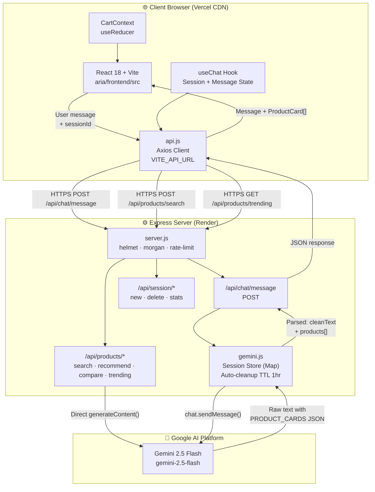
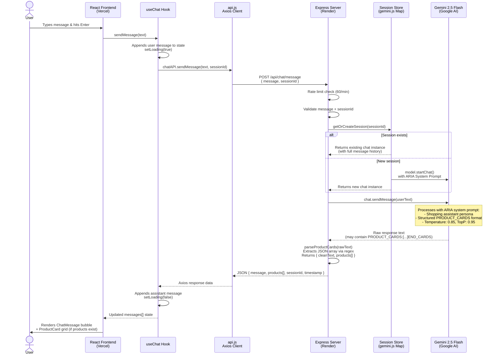

# ✦ ARIA — AI Shopping Assistant

### *Your personal GenAI shopping concierge. Ask anything. Discover everything.*

<p align="center">
  
  
  
  
  
  
  
  
</p>

---

> **ARIA** (Adaptive Retail Intelligence Assistant) is a full-stack, AI-powered shopping assistant that transforms how users discover and evaluate products. Powered by **Google Gemini 2.5 Flash**, ARIA conducts natural multi-turn conversations, surfaces structured product cards with live recommendations, runs AI-generated product comparisons, and manages a full client-side cart — all wrapped in a luxury dark-gold UI built from scratch with pure CSS.

---

## 📋 Table of Contents

- [✨ Key Features](#-key-features)
- [🏗️ System Architecture](#%EF%B8%8F-system-architecture)
- [🔄 Query Logic Flow](#-query-logic-flow)
- [🛠️ Tech Stack](#%EF%B8%8F-tech-stack)
- [📁 Project Structure](#-project-structure)
- [⚡ Local Installation & Setup](#-local-installation--setup)
- [🔐 Environment Variables](#-environment-variables)
- [🚀 Live Deployment Guide](#-live-deployment-guide)
- [🗺️ Future Roadmap](#%EF%B8%8F-future-roadmap)
- [👥 Team](#-team)
- [📄 License](#-license)

---

## ✨ Key Features

| Feature | Description |
|---|---|
| 🤖 **Multi-Turn AI Chat** | Persistent, context-aware conversations powered by Gemini 2.5 Flash. Each session maintains full message history so ARIA remembers what was discussed earlier in the conversation. |
| 🃏 **Inline Product Cards** | ARIA's responses embed structured `PRODUCT_CARDS` JSON blocks that the backend parses and returns as rich product objects — rendered as interactive cards directly inside the chat thread. |
| 🔍 **AI-Powered Search** | The header search bar sends queries to a dedicated `/api/products/search` endpoint where Gemini generates 6 realistic, curated product results in Indian Rupees with ratings, discounts, and badges. |
| 📈 **Trending Feed** | A dedicated "Trending Now" tab fetches 8 live, AI-curated trending products across electronics, fashion, beauty, home, and fitness categories on every app load. |
| ⚖️ **Smart Comparisons** | Users can ask ARIA to compare any two products by name. The `/api/products/compare` endpoint generates a full JSON comparison with pros, cons, a score, and a declared winner. |
| 🛒 **Full Cart System** | Add, remove, and adjust quantities with a slide-in CartSidebar. Cart state is managed globally via React Context + `useReducer` — no third-party state library needed. |
| 💡 **Starter Suggestions** | On first load, 8 curated conversation starters (fetched from `/api/chat/suggestions`) appear as clickable chips to help users immediately engage without needing to type. |
| 🛡️ **Production-Grade API** | The Express backend uses `helmet` for security headers, `morgan` for HTTP logging, and `express-rate-limit` (60 req/min per IP) to prevent abuse. |
| 🧹 **Auto Session Cleanup** | In-memory Gemini chat sessions are automatically purged after 1 hour of inactivity via a `setInterval` cleanup loop, preventing memory leaks in long-running deployments. |
| 🎨 **Luxury Dark UI** | Zero Tailwind, zero component libraries. The entire design system is hand-crafted using CSS custom properties (`--gold`, `--bg-void`, `--radius-lg`), the `Cormorant Garamond` display font, and `DM Sans` body font. |

---

## 🏗️ System Architecture

The project is split into two independently deployed services that communicate over HTTPS in production.



---

## 🔄 Query Logic Flow

This diagram traces exactly what happens from the moment a user types a shopping query to when they see ARIA's response rendered with product cards.



---

## 🛠️ Tech Stack

### 🖥️ Frontend — `aria/frontend`

| Technology | Version | Role |
|---|---|---|
| **React** | 18.3.1 | UI component framework |
| **Vite** | 5.2.11 | Build tool & dev server with `/api` proxy |
| **Axios** | 1.6.8 | HTTP client with `VITE_API_URL` base config |
| **Lucide React** | 0.383.0 | Icon system (Send, ShoppingBag, Search, etc.) |
| **React Hot Toast** | 2.4.1 | Non-intrusive toast notifications |
| **UUID** | 9.0.1 | Client-side session ID generation |
| **Pure CSS** | — | Hand-crafted design system via CSS custom properties |

**State Management:** React Context API + `useReducer` (CartContext) · Custom hook `useChat` for session and message state.

**Fonts:** `Cormorant Garamond` (display/headings) · `DM Sans` (body/UI) · `DM Mono` (timestamps/numbers)

---

### ⚙️ Backend — `aria/backend`

| Technology | Version | Role |
|---|---|---|
| **Node.js** | ≥ 18.0.0 | JavaScript runtime |
| **Express** | 4.18.2 | HTTP server & routing |
| **@google/generative-ai** | 0.21.0 | Official Gemini SDK |
| **Helmet** | 7.1.0 | Security HTTP headers |
| **Morgan** | 1.10.0 | HTTP request logging |
| **CORS** | 2.8.5 | Cross-origin resource sharing |
| **express-rate-limit** | 7.2.0 | 60 req/min API protection |
| **dotenv** | 16.4.5 | Environment variable loading |
| **UUID** | 9.0.1 | Session ID generation |

**Module System:** ES Modules (`"type": "module"`) throughout.

---

### 🧠 AI Layer

| Property | Value |
|---|---|
| **Model** | `gemini-2.5-flash` |
| **Provider** | Google AI Studio |
| **Max Output Tokens** | 1,500 per chat turn |
| **Temperature** | 0.85 |
| **Top-P** | 0.95 |
| **Session Strategy** | Per-user in-memory `Map` with 1-hour TTL auto-cleanup |
| **System Prompt** | ARIA persona: warm, concise personal shopper with structured `PRODUCT_CARDS` output format |

---

### ☁️ Deployment

| Layer | Platform | Config |
|---|---|---|
| **Frontend** | Vercel (CDN Edge) | Root: `aria/frontend` · Build: `npm run build` · Output: `dist` |
| **Backend** | Render (Web Service) | Root: `aria/backend` · Start: `node server.js` · Health: `/api/health` |

---

## 📁 Project Structure

```
ARIA-Ai-assitance-main/
│
├── app.js                          ← Vanilla JS prototype (standalone demo)
├── index.html                      ← Prototype HTML entry point
├── style.css                       ← Prototype stylesheet
├── render.yaml                     ← Render IaC deployment config
│
└── aria/                           ← Full-stack production application
    │
    ├── README.md
    │
    ├── backend/
    │   ├── server.js               ← Express entry: helmet, CORS, rate-limit, routes
    │   ├── package.json            ← ES Module · Node ≥18 engine lock
    │   ├── .env                    ← 🔒 Local secrets (gitignored)
    │   ├── .env.example            ← Safe template for onboarding
    │   ├── .nvmrc                  ← Node version pin: 18
    │   │
    │   ├── services/
    │   │   └── gemini.js           ← Gemini client · Session Map · TTL cleanup · ARIA system prompt
    │   │
    │   └── routes/
    │       ├── chat.js             ← POST /message · GET /suggestions · PRODUCT_CARDS parser
    │       ├── products.js         ← /search · /recommend · /compare · /trending
    │       └── session.js          ← POST /new · DELETE /:id · GET /stats
    │
    └── frontend/
        ├── index.html
        ├── vite.config.js          ← Dev proxy: /api → :5000 · Vendor chunk splitting
        ├── vercel.json             ← SPA rewrite rules · Asset cache headers
        ├── package.json
        │
        └── src/
            ├── main.jsx            ← React root mount
            ├── App.jsx             ← Root layout: tabs (Chat / Trending), input bar, search overlay
            │
            ├── styles/
            │   └── globals.css     ← Full design system: CSS vars, keyframes, utility classes
            │
            ├── components/
            │   ├── Header.jsx      ← Sticky nav: logo, AI search bar, cart button with badge
            │   ├── ChatMessage.jsx ← Bubble renderer: custom markdown parser + ProductCard grid
            │   ├── ProductCard.jsx ← Product tile: image, badge, rating stars, wishlist, add-to-cart
            │   ├── CartSidebar.jsx ← Slide-in drawer: item list, qty controls, subtotal, checkout
            │   ├── SearchResults.jsx ← Dismissible overlay grid for header search results
            │   └── TypingIndicator.jsx ← Animated 3-dot typing bubble
            │
            ├── context/
            │   └── CartContext.jsx ← Global cart: useReducer (ADD/REMOVE/UPDATE_QTY/CLEAR)
            │
            ├── hooks/
            │   └── useChat.js      ← Session init · message state · sendMessage · clearChat
            │
            └── services/
                └── api.js          ← Axios instance · chatAPI · sessionAPI · productsAPI
```

---

## ⚡ Local Installation & Setup

### Prerequisites

- **Node.js** v18 or higher — [download](https://nodejs.org)
- **npm** v9 or higher (bundled with Node)
- A **Google Gemini API key** — [get one free](https://aistudio.google.com/app/apikey)

---

### Step 1 — Clone the Repository

```bash
git clone https://github.com/YOUR_USERNAME/ARIA-Ai-assitance-main.git
cd ARIA-Ai-assitance-main
```

---

### Step 2 — Set Up the Backend

```bash
# Navigate to the backend directory
cd aria/backend

# Install dependencies
npm install

# Create your local environment file from the template
cp .env.example .env
```

Now open `aria/backend/.env` and fill in your values:

```env
PORT=5000
GEMINI_API_KEY=your_gemini_api_key_here
NODE_ENV=development
FRONTEND_URL=http://localhost:5173
```

Start the backend dev server:

```bash
npm run dev
# ✅ ARIA Backend running on http://localhost:5000
# 🔑 Gemini API: Connected
```

---

### Step 3 — Set Up the Frontend

Open a **second terminal** and run:

```bash
# From the project root
cd aria/frontend

# Install dependencies
npm install
```

Create the frontend environment file:

```bash
# Create .env.local in aria/frontend/
echo "VITE_API_URL=http://localhost:5000/api" > .env.local
```

> **Note:** In development, Vite's built-in proxy (`vite.config.js`) forwards all `/api` requests to `localhost:5000`, so `VITE_API_URL` is only strictly needed for production. Setting it locally is good practice.

Start the frontend dev server:

```bash
npm run dev
# Local:   http://localhost:5173/
```

---

### Step 4 — Open the App

Visit **[http://localhost:5173](http://localhost:5173)** in your browser. You should see ARIA's welcome message appear immediately.

---

### All Commands at a Glance

```bash
# Backend
cd aria/backend && npm install && npm run dev      # Dev server on :5000
cd aria/backend && npm start                        # Production server

# Frontend
cd aria/frontend && npm install && npm run dev      # Dev server on :5173
cd aria/frontend && npm run build                   # Production build → dist/
cd aria/frontend && npm run preview                 # Preview production build locally
```

---

## 🔐 Environment Variables

### Backend — `aria/backend/.env`

| Variable | Required | Example Value | Description |
|---|---|---|---|
| `GEMINI_API_KEY` | ✅ Yes | `AIzaSy...` | Your Google AI Studio API key. The server will **exit immediately** on startup if this is missing. |
| `PORT` | ✅ Yes | `5000` | The port Express listens on. Render overrides this with `10000` automatically. |
| `NODE_ENV` | ✅ Yes | `production` | Set to `production` on Render, `development` locally. |
| `FRONTEND_URL` | ✅ Yes | `https://your-app.vercel.app` | Comma-separated list of allowed CORS origins. Accepts multiple values: `http://localhost:5173,https://your-app.vercel.app` |

### Frontend — `aria/frontend/.env.local` (dev) or Vercel Dashboard (prod)

| Variable | Required | Example Value | Description |
|---|---|---|---|
| `VITE_API_URL` | ✅ Yes (prod) | `https://aria-backend.onrender.com/api` | The full base URL of the Render backend. Must include `/api`. The `VITE_` prefix is **mandatory** — Vite only exposes variables with this prefix to the browser bundle. |

> ⚠️ **Security Note:** Never commit your `.env` file to version control. Both `aria/backend/.env` and `aria/frontend/.env.local` are listed in `.gitignore`. Use `.env.example` as a safe, committed reference template.

---

## 🚀 Live Deployment Guide

ARIA is deployed as a **split-stack architecture**: the React frontend lives on Vercel's global CDN edge network, while the stateful Express + Gemini backend runs as a persistent web service on Render.

```
User Request
     │
     ▼
┌─────────────────────┐       HTTPS        ┌──────────────────────────┐
│  Vercel Edge CDN    │ ──────────────────► │   Render Web Service     │
│  aria/frontend      │   /api/* requests   │   aria/backend           │
│  React + Vite SPA   │                     │   Express + Gemini SDK   │
└─────────────────────┘                     └──────────────────────────┘
                                                        │
                                                        ▼
                                              ┌─────────────────────┐
                                              │  Google AI Platform  │
                                              │  Gemini 2.5 Flash   │
                                              └─────────────────────┘
```

### Frontend → Vercel

| Setting | Value |
|---|---|
| **Root Directory** | `aria/frontend` |
| **Framework Preset** | Vite |
| **Build Command** | `npm run build` |
| **Output Directory** | `dist` |
| **Env Variable** | `VITE_API_URL` = `https://your-render-service.onrender.com/api` |

The included `aria/frontend/vercel.json` configures SPA rewrite rules (all routes → `index.html`) and sets long-term cache headers on static assets in `/assets/`.

### Backend → Render

| Setting | Value |
|---|---|
| **Root Directory** | `aria/backend` |
| **Environment** | Node |
| **Build Command** | `npm install` |
| **Start Command** | `node server.js` |
| **Health Check Path** | `/api/health` |
| **Env Variables** | `GEMINI_API_KEY`, `FRONTEND_URL`, `NODE_ENV=production` |

The included `render.yaml` at the project root encodes all of this configuration as Infrastructure-as-Code, allowing Render to auto-detect the service on first import.

**CORS** is dynamically configured to read allowed origins from `FRONTEND_URL`, supporting both local development and production Vercel URLs without any code changes.

---

## 🗺️ Future Roadmap

The current build is a strong, hackathon-ready MVP. Here are the most impactful directions for scaling ARIA into a full production product:

#### 🔐 `v1.1` — User Authentication & Persistent Sessions
Integrate **Clerk** or **Supabase Auth** to give users accounts. Replace the in-memory session `Map` in `gemini.js` with a **Redis** store (via Upstash) so conversation history survives backend restarts and scales horizontally across multiple Render instances.

#### 🏬 `v1.2` — Real Product Catalog Integration
Replace the Gemini-hallucinated product data with a real database. Connect to the **Flipkart Affiliate API**, **Amazon Product Advertising API**, or build a custom catalog in **PostgreSQL** (via Supabase). ARIA would then query real, purchasable products with live pricing — and the "Proceed to Checkout" button in CartSidebar would route to actual purchase flows.

#### 🗣️ `v1.3` — Voice Interface
Add a microphone button to the chat input using the **Web Speech API** for speech-to-text input, and **ElevenLabs** or the **Web Speech Synthesis API** for ARIA's voice responses. This transforms ARIA from a chat interface into a true voice-first shopping concierge — ideal for mobile shoppers.

#### 📊 `v1.4` — Analytics Dashboard & A/B Testing
Instrument every interaction (search queries, product card clicks, add-to-cart events, session duration) using **PostHog** or **Mixpanel**. Build an internal dashboard showing the top searched categories, most-added products, and average conversation depth. Use this data to improve the Gemini system prompt and optimize ARIA's recommendation quality over time.

---

## 👥 Team

This project was built for **Kasparro Hackathon** by:

<table>
  <tr>
    <td align="center">
      <strong>Team Member 1</strong><br/>
      <sub>Full Stack · AI Integration</sub><br/>
      <a href="https://github.com/thestethoguy">@Aman Aaryan</a>
    </td>
    <td align="center">
      <strong>Team Member 2</strong><br/>
      <sub>UI/UX · Frontend Engineering</sub><br/>
      <a href="https://github.com/DivyanshShukla001">@Divyansh Shukla</a>
    </td>
  </tr>
</table>

---

## 📄 License

This project is licensed under the **MIT License** — see the [LICENSE](./LICENSE) file for details.

---

<p align="center">
  <strong>Built with ✦ and Google Gemini for [Hackathon Name] 2025</strong><br/>
  <sub>ARIA · Adaptive Retail Intelligence Assistant</sub>
</p>
